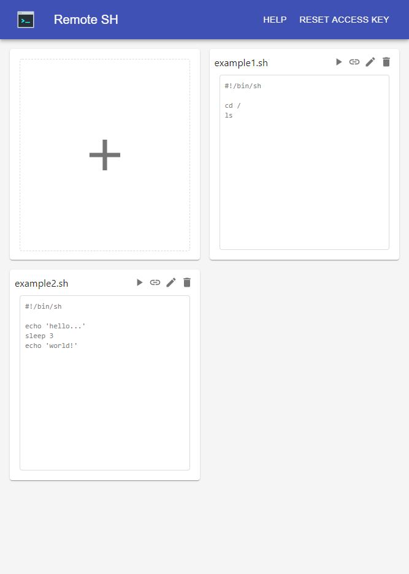
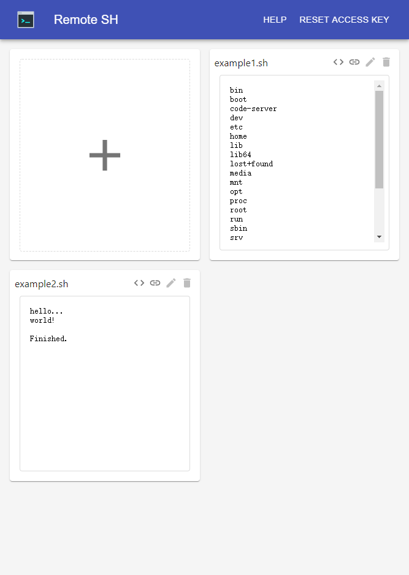

# remote-sh

中文文档 |
[English Documents](./README.md)

使用 Web 界面管理和运行你的 shell 脚本吧！

`remote-sh` 提供了一种相当友好的方式去管理你服务器上的 shell 脚本。 你可以轻松地添加、修改、删除、运行它们。

每个脚本可以被一个独特的 URL 请求触发运行，例如：

```
$ curl https://YOUR_REMOTE_SH_HOST/script/run/example.sh/UNIQUE_SIGN_FOR_THIS_SCRIPT
```

这套系统利用 Access Key 策略来认证你的身份。





## 安装

```
$ npm ci
```

## 部署

请确保这行命令的持续运行：

```
$ npm start
```

### 端口

在文件 `./configs.js` 中设置端口（默认：3000）。

### HTTPS

我们强烈建议启用 HTTPS。

为了启用 HTTPS，请在文件`./configs.js`中设置`useHttps: true` 和 `port: 443`，然后拷贝你的证书文件至`./https/server.key` 和 `./https/server.crt`。

你也可以用其他手段启用 HTTPS（我个人推荐 [steveltn/https-portal](https://hub.docker.com/r/steveltn/https-portal/)）。

### 后台运行

使用 `pm2, screen, docker` 这些工具可以轻松做到这一点。
